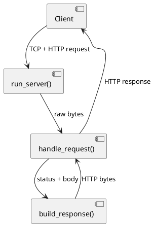
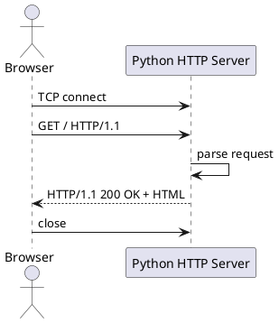

# Вариативная часть: собственный HTTP-сервер на Python

## 1. Тема и цель исследования

**Тема:** разработка собственного HTTP-сервера на Python с нуля.

**Цель:** понять, как работает сетевое взаимодействие по протоколу HTTP на низком уровне, и реализовать минимальный рабочий сервер без сторонних веб-фреймворков.

---

## 2. Что такое HTTP-сервер (кратко)

HTTP-сервер:
1. принимает TCP-подключение;
2. читает HTTP-запрос от клиента;
3. разбирает метод и путь;
4. формирует HTTP-ответ (статус, заголовки, тело);
5. отправляет ответ и закрывает соединение.

---

## 3. Архитектура решения

Реализация находится в файле: `src/main.py`.

Компоненты:
- `run_server()` — запуск сокета, приём подключений;
- `handle_request()` — парсинг HTTP-запроса и выбор маршрута;
- `build_response()` — сборка корректного HTTP-ответа.

### UML-диаграмма компонентов (PlantUML)



---

## 4. Пошаговое создание сервера

### Шаг 1. Создать TCP-сокет

```python
server = socket.socket(socket.AF_INET, socket.SOCK_STREAM)
server.setsockopt(socket.SOL_SOCKET, socket.SO_REUSEADDR, 1)
server.bind(("127.0.0.1", 8080))
server.listen(5)
```

### Шаг 2. Принимать подключение и читать запрос

```python
client_socket, client_address = server.accept()
request_data = client_socket.recv(4096)
```

### Шаг 3. Разобрать первую строку запроса

```python
request_line = request_text.splitlines()[0]
method, path, _ = request_line.split(" ")
```

### Шаг 4. Реализовать маршрутизацию

- `GET /` → HTML-страница о том, что сервер работает;
- `GET /health` → JSON-ответ `{"status":"ok"}`;
- всё остальное → `404 Not Found`.

### Шаг 5. Собрать HTTP-ответ

Ответ должен содержать:
- статусную строку (`HTTP/1.1 200 OK`);
- заголовки (`Content-Type`, `Content-Length`, `Date`);
- пустую строку;
- тело ответа.

---

## 5. Пример работы протокола

### Последовательность (UML Sequence)



---

## 6. Запуск и проверка

Из корня проекта:

```bash
python src/main.py
```

Проверка в браузере:
- `http://127.0.0.1:8080/`
- `http://127.0.0.1:8080/health`

Проверка через curl:

```bash
curl -i http://127.0.0.1:8080/
curl -i http://127.0.0.1:8080/health
```

---

## 7. Типичные ошибки и их исправление

1. **400 Bad Request** — некорректный формат запроса.
   - Проверить обработку пустых/битых данных.
2. **Порт занят** — ошибка bind.
   - Сменить порт или завершить конфликтующий процесс.
3. **Кодировка** — кракозябры в ответе.
   - Использовать UTF-8 и заголовок `charset=utf-8`.

---

## 8. Иллюстрации для отчёта (можно заменить своими)

Ниже добавлены шаблонные места для 3–10 иллюстраций, как требует задание:


> Если файлов пока нет, просто добавь изображения с этими именами в `site/static/images/` или замени пути на свои.

---

## 9. Итоги исследования

В рамках вариативной части был реализован минимальный HTTP-сервер, демонстрирующий ключевые принципы веб-разработки на сетевом уровне:

- работа TCP-сокетов;
- структура HTTP-запроса/ответа;
- базовая маршрутизация;
- формирование корректных заголовков и статусов.

Этот результат можно расширять до многопоточной версии, поддержки POST/JSON и раздачи статических файлов.
