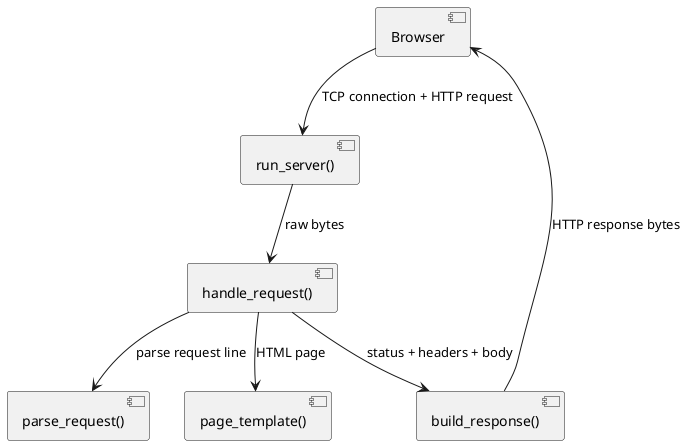
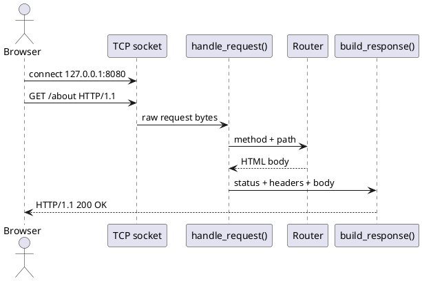

# Вариативная часть: презентационный HTTP-сервер на Python

## 1. Тема и цель исследования

**Тема:** разработка собственного HTTP-сервера на Python без использования веб-фреймворков.

**Цель:** разобраться, как устроен HTTP на низком уровне, и создать не просто минимальный ответ `Hello world`, а презентабельный учебный сервер с HTML-интерфейсом, маршрутизацией, JSON API и обработкой ошибок.

Реализация находится в файле: `src/main.py`.

---

## 2. Что получилось в итоговой версии

Сервер `PolyQuestSocketHTTP/2.0` работает на TCP-сокетах и поддерживает несколько страниц:

| Маршрут | Назначение |
|---|---|
| `GET /` | главная презентационная страница сервера |
| `GET /about` | описание принципа работы: TCP, HTTP, routing |
| `GET /routes` | список доступных маршрутов |
| `GET /api/status` | JSON-ответ со статусом сервера |
| `GET /hello?name=Георгий` | динамическая страница с query-параметром |
| `GET /health` | короткий JSON для проверки работоспособности |

Дополнительно реализованы:

- единый HTML-шаблон для страниц;
- встроенные CSS-стили в тёмной теме PolyQuest;
- корректные HTTP-заголовки `Date`, `Server`, `Content-Type`, `Content-Length`, `Connection`;
- обработка `400 Bad Request`, `404 Not Found`, `405 Method Not Allowed`;
- логирование запросов в консоль;
- безопасный вывод пользовательского параметра через `html.escape()`.

---

## 3. Архитектура решения

Основные компоненты файла `src/main.py`:

- `run_server()` — создаёт TCP-сокет, запускает цикл ожидания клиентов;
- `parse_request()` — разбирает первую строку HTTP-запроса;
- `handle_request()` — проверяет метод, выбирает маршрут и возвращает ответ;
- `build_response()` — собирает HTTP-ответ из статуса, заголовков и тела;
- `page_template()` — формирует единый HTML-макет;
- `home_page()`, `about_page()`, `routes_page()`, `hello_page()` — HTML-страницы;
- `status_json()` — JSON API со служебной информацией.

### UML-диаграмма компонентов



---

## 4. Как работает HTTP-сервер на сокетах

HTTP-сервер выполняет пять базовых действий:

1. Открывает TCP-сокет.
2. Привязывается к адресу `127.0.0.1:8080`.
3. Принимает подключение браузера.
4. Читает текстовый HTTP-запрос.
5. Отправляет HTTP-ответ и закрывает соединение.

В коде это выглядит так:

```python
with socket.socket(socket.AF_INET, socket.SOCK_STREAM) as server:
    server.setsockopt(socket.SOL_SOCKET, socket.SO_REUSEADDR, 1)
    server.bind((HOST, PORT))
    server.listen(10)

    while True:
        client_socket, client_address = server.accept()
        with client_socket:
            request_data = client_socket.recv(BUFFER_SIZE)
            response, method, path = handle_request(request_data)
            client_socket.sendall(response)
```

---

## 5. Разбор HTTP-запроса

Браузер отправляет запрос примерно такого вида:

```http
GET /hello?name=Георгий HTTP/1.1
Host: 127.0.0.1:8080
User-Agent: Mozilla/5.0
```

Серверу достаточно первой строки, чтобы понять:

- метод: `GET`;
- путь: `/hello`;
- query string: `name=Георгий`;
- версию протокола: `HTTP/1.1`.

Функция `parse_request()` использует `urlparse()` и `parse_qs()`:

```python
request_line = request_text.splitlines()[0]
method, target, version = request_line.split(" ", maxsplit=2)
parsed_url = urlparse(target)
query = parse_qs(parsed_url.query)
```

---

## 6. Маршрутизация

В `handle_request()` маршруты описаны словарём:

```python
routes = {
    "/": lambda: build_response(200, "OK", home_page()),
    "/about": lambda: build_response(200, "OK", about_page()),
    "/routes": lambda: build_response(200, "OK", routes_page()),
    "/hello": lambda: build_response(200, "OK", hello_page(request)),
    "/api/status": lambda: build_response(
        200,
        "OK",
        status_json(),
        "application/json; charset=utf-8",
    ),
}
```

Если путь найден, сервер вызывает соответствующую функцию. Если путь отсутствует — возвращает красивую HTML-страницу `404 Not Found`.

---

## 7. Формирование HTTP-ответа

HTTP-ответ состоит из:

1. статусной строки;
2. заголовков;
3. пустой строки;
4. тела ответа.

Пример ответа:

```http
HTTP/1.1 200 OK
Date: Mon, 04 May 2026 11:00:00 GMT
Server: PolyQuestSocketHTTP/2.0
Content-Type: text/html; charset=utf-8
Content-Length: 1234
Connection: close

<!doctype html>...
```

В коде ответ собирается функцией `build_response()`:

```python
body_bytes = body.encode("utf-8")
headers = [
    f"HTTP/1.1 {status_code} {reason}",
    f"Content-Type: {content_type}",
    f"Content-Length: {len(body_bytes)}",
    "Connection: close",
    "",
    "",
]
return "\r\n".join(headers).encode("utf-8") + body_bytes
```

---

## 8. Динамическая страница `/hello`

Маршрут `/hello?name=Георгий` показывает, что сервер умеет работать не только со статичным HTML, но и с параметрами запроса.

```python
name = request.query.get("name", ["гость PolyQuest"])[0]
safe_name = escape(name[:60])
```

Здесь важно использовать `escape()`, чтобы пользовательский ввод безопасно отображался в HTML.

---

## 9. JSON API

Маршрут `/api/status` возвращает JSON:

```json
{
  "status": "ok",
  "project": "PolyQuest",
  "server": "PolyQuestSocketHTTP/2.0",
  "host": "127.0.0.1",
  "port": 8080,
  "routes": ["/", "/about", "/routes", "/api/status", "/hello?name=Георгий"]
}
```

Для JSON выставляется отдельный заголовок:

```http
Content-Type: application/json; charset=utf-8
```

---

## 10. Запуск и проверка

Из корня проекта:

```bash
python src/main.py
```

После запуска в консоли появится:

```text
[INFO] PolyQuestSocketHTTP/2.0 запущен: http://127.0.0.1:8080
[INFO] Доступные страницы: /, /about, /routes, /api/status, /hello?name=Георгий
[INFO] Для остановки нажмите Ctrl+C
```

Открыть в браузере:

- `http://127.0.0.1:8080/`
- `http://127.0.0.1:8080/about`
- `http://127.0.0.1:8080/routes`
- `http://127.0.0.1:8080/hello?name=Георгий`
- `http://127.0.0.1:8080/api/status`

Проверка через `curl`:

```bash
curl -i http://127.0.0.1:8080/
curl -i http://127.0.0.1:8080/api/status
curl -i http://127.0.0.1:8080/not-found
```

Остановить сервер можно сочетанием клавиш `Ctrl+C`.

---

## 11. Диаграмма последовательности



---

## 12. Типичные ошибки и решения

1. **Порт 8080 занят**
   - Закрыть другой процесс или изменить константу `PORT` в `src/main.py`.

2. **Страница не открывается**
   - Проверить, что сервер запущен командой `python src/main.py`.
   - Убедиться, что адрес указан полностью: `http://127.0.0.1:8080/`.

3. **Кириллица отображается неправильно**
   - В ответе должен быть заголовок `charset=utf-8`.
   - Тело ответа кодируется через `.encode("utf-8")`.

4. **405 Method Not Allowed**
   - Сервер учебный и поддерживает только метод `GET`.

---

## 13. Итоги исследования

В рамках вариативной части был создан презентационный HTTP-сервер на Python, который демонстрирует:

- работу TCP-сокетов;
- структуру HTTP-запроса и HTTP-ответа;
- ручную маршрутизацию без веб-фреймворков;
- генерацию HTML-страниц;
- выдачу JSON API;
- обработку ошибок `400`, `404`, `405`;
- безопасную работу с query-параметрами.

Итоговый результат выглядит более наглядно, чем минимальный сервер, и может быть показан как самостоятельная вариативная часть практики.